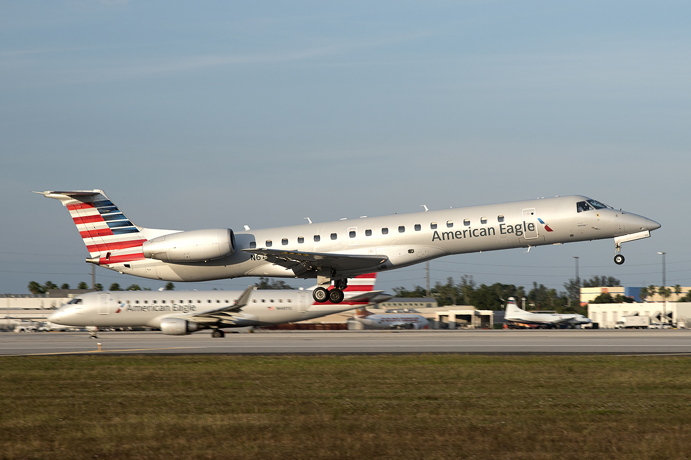

### About

My name is Maxwell Su, I'm a grad student at NC State, and this is my github blog.

I'm not entirely sure what i'll blog about, as I'm not very good at writing, and I don't think my life is interesting enough to talk at length about, but I'll do my best.

As for waffling, I used to be an aviation photographer. I've planespotted at various airports across the country, including:

* KRDU
* KCLT
* KATL
* KIAD
* KDCA
* KMIA
* PHNL

I've attatched an example of my work below:

 

If the work of an amateur aviation photographer interests you, you can contact me at ssue747@gmail.com.
